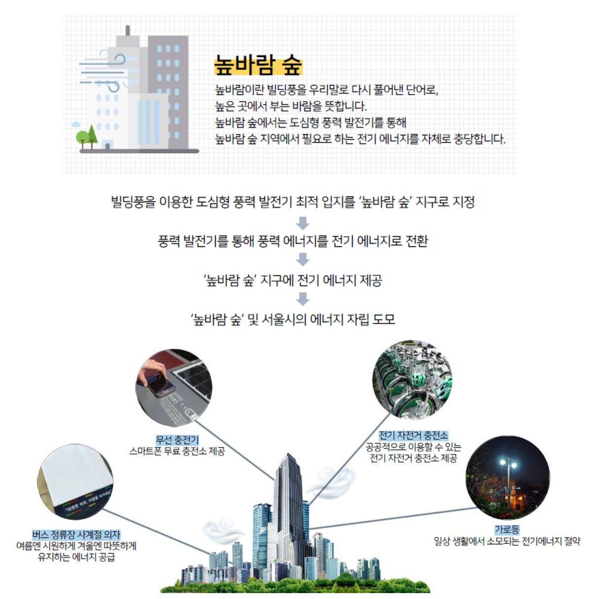

# 서울시 ‘높바람 숲’ 최적 사업지 선정 프로젝트
2019 서울시 빅데이터캠퍼스 공모전 최우수상 수상작 

## Goal 
#### **자유주제**  
[서울시 빅데이터캠퍼스](https://bigdata.seoul.go.kr/data/selectPageListSampleDataSet.do?r_id=P213)의 데이터를 활용한 분석  
 
### Overview
빌딩풍을 이용한 도심형 풍력발전기 설치 최적 입지 선정  

**[Problem]**  
전기 에너지 수급 의존도가 높은 서울시의 **청정 에너지 자립도를 높일 수 있는** 신재생 에너지 사업을 제안해야 함

**[Solution]**  
고층 건물이 밀집된 지역에서 발생하는 빌딩풍을 풍력 에너지로 활용하기 위해 **도심형 풍력발전기를 설치**  

**[Key point]**
- 빌딩풍이 발생할 수 있는 최소 풍속인 유효 풍속을 계산하여 사업지 선정 기준에 반영
- 예상 생산 전력량을 바탕으로 높바람 숲 예상 시나리오를 제시함

- - -

### Timeline
2019.09 ~ 2019.10

### Team
충정로 칼바람 / 강승연, 백희연, 조유민, 한지혜

### Role
전반적인 시각화를 주도하였으며 유효 풍속 도출에 필요한 변수 계산 및 건물 샘플링을 담당하였음

### Presentation
[발표 자료](2019_서울시_빅캠공모전_충정로칼바람_분석결과서.pdf)

### References
[참고 문헌](https://scienceon.kisti.re.kr/srch/selectPORSrchArticle.do?cn=JAKO201810648287497&dbt=NART)
